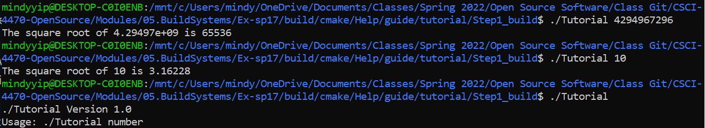
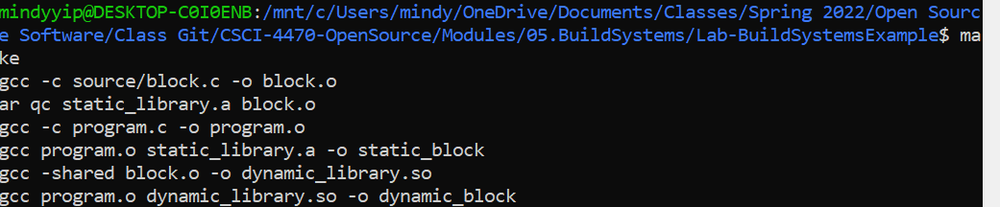

## Lab 5

### Step 1

[Link to tutorial.cxx](/code/Step1/tutorial.cxx)

[Link to CMakeLists.txt](/code/Step1/CmakeLists.txt)

### Step 2

[Link to tutorial.cxx](/code/Step2/tutorial.cxx)

[Link to CMakeLists.txt](/code/Step2/CMakeLists.txt)

### Step 3

[Link to CMakeLists.txt](/code/Step3/CMakeLists.txt)

[Link to MathFunctions/CMakeLists.txt](/code/Step3/MathFunctions/CMakeLists.txt)

### Step 4

[Link to CMakeLists.txt](/code/Step4/CMakeLists.txt)

[Link to MathFunctions/CMakeLists.txt](/code/Step4/MathFunctions/CMakeLists.txt)

### Step 5

[Link to CMakeLists.txt](/code/Step5/CMakeLists.txt)

[Link to MathFunctions/CMakeLists.txt](/code/Step5/MathFunctions/CMakeLists.txt)

### make step 

### Makefile

[Link to Makefile](/code/Lab-BuildSystemsExample/Makefile)

[Link to CMakeLists.txt](/code/Lab-BuildSystemsExample/CMakelists.txt)

[Makefile created by cmake](/code/build/Makefile)

### Size comparison 

The relative size of the shared program is a bit smaller than the static program.

### Results of running the program

